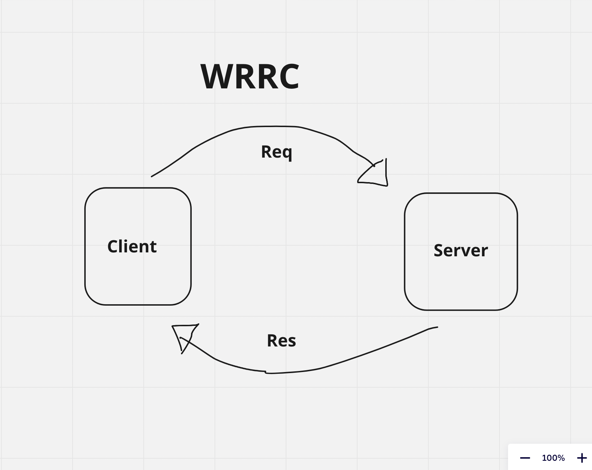
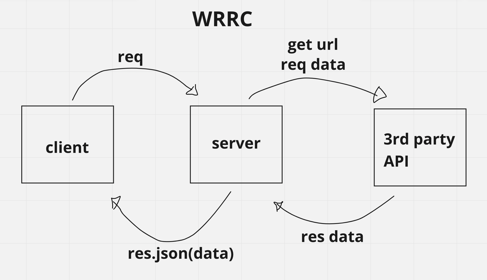
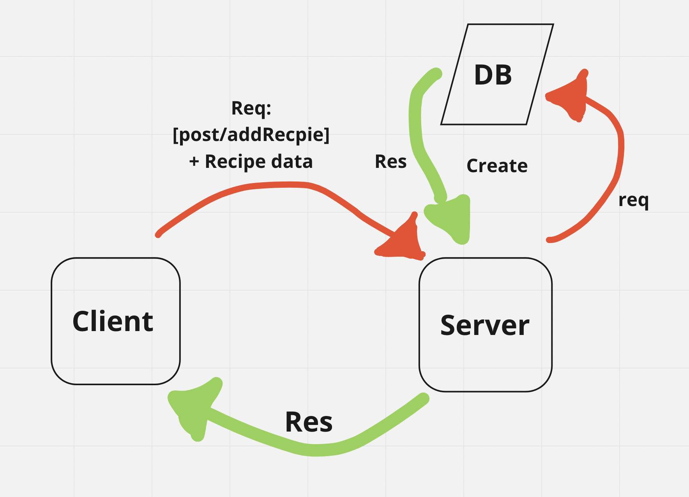

# Movies-Library

**Author Name**: Sajeda Alrababah

## WRRC

## Overview

start build server for Movie project.

## Getting Started
<!-- What are the steps that a user must take in order to build this app on their own machine and get it running? -->
1.create a variable for express and port.
2.add app listining to port you saved.
3.add app.get to named your router and handle function.
4.and in the function use res, req to get the data you are saved in constructer function .
5.and sure you will build a counstructer and return it for your data.

## Project Features

<!-- What are the features included in you app -->

get data from the server to client without using frontend.
